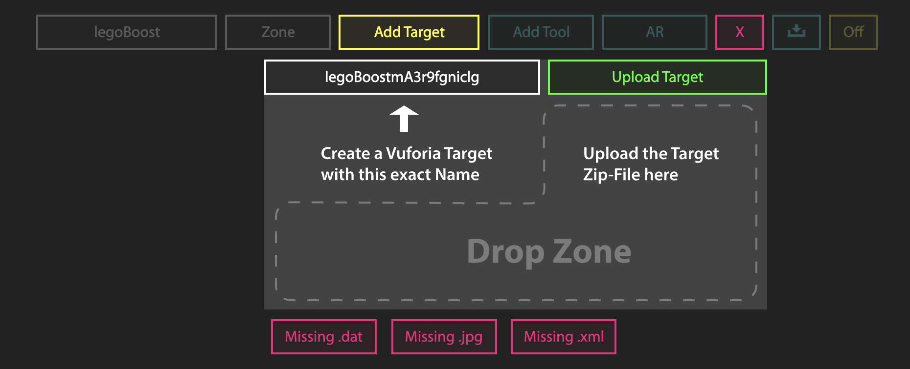
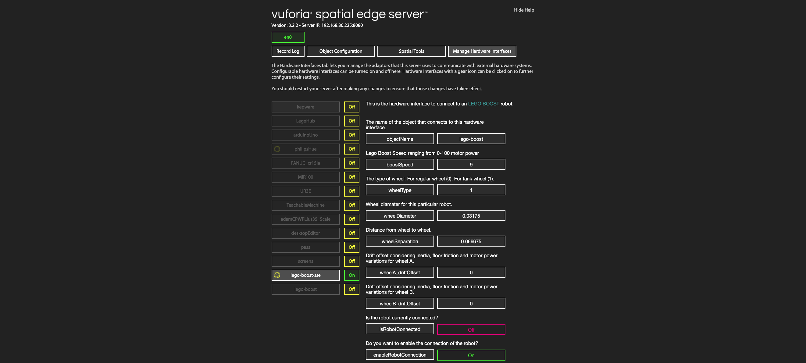
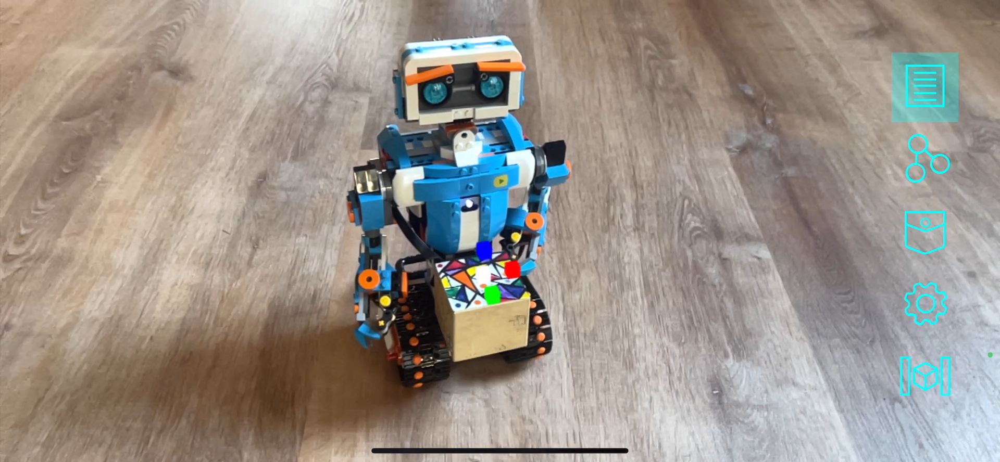
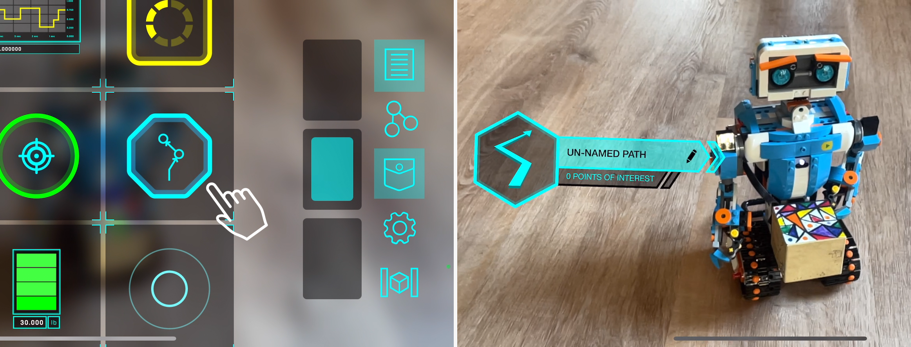
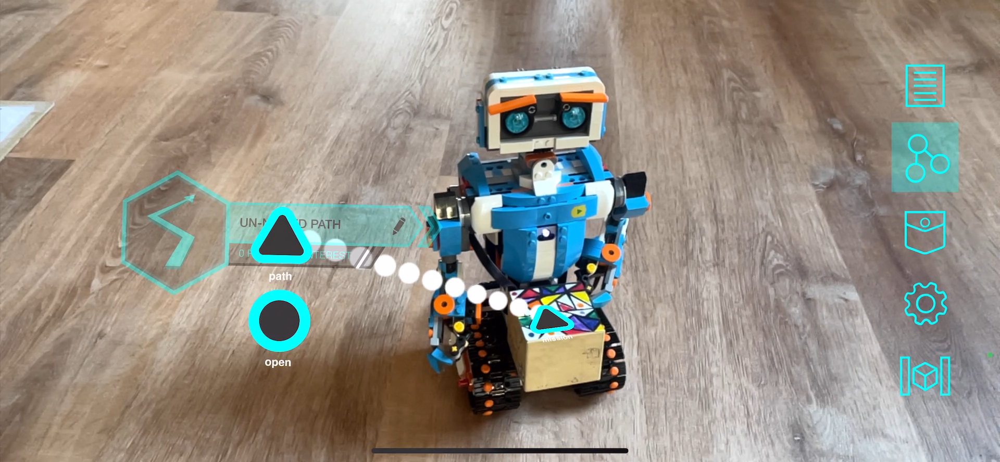
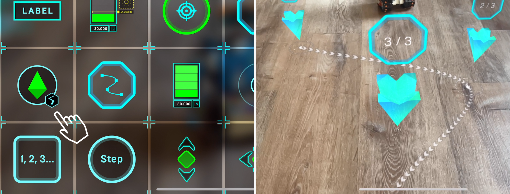

# vuforia-spatial-motion-addon

This repository contains the tools, nodes and hardware interfaces to do explorations on motion interaction with the Vuforia Spatial Toolbox.

In this README file we will explain how to setup a path planning interface for the [Lego Boost](https://www.lego.com/en-us/product/boost-creative-toolbox-17101) as a first example.


## Getting Started
### Prerequisites

* A Lego Boost robot running on 2 wheels (either tank or regular)
* A laptop to be able to run the Vuforia Spatial Edge Server
* A mobile phone with the Vuforia Spatial Toolbox application installed
* You will also need the [Vuforia](https://developer.vuforia.com/) object target or image target to identify the robot with the mobile device [Later explained]

### Preparing the components

1. Download the [vuforia-spatial-edge-server](https://github.com/ptcrealitylab/vuforia-spatial-edge-server) code and place it in your Development folder on your computer.

2. Download the [vuforia-spatial-motion-addon](https://github.com/ptcrealitylab/vuforia-spatial-motion-addon) code and place it in the following folder: ```
                                                                                                                                                        vuforia-spatial-edge-server/addons/
                                                                                                                                                        ```
3. npm install in both folders

4. Make sure you have the Vuforia Spatial Toolbox application installed in your phone.

5. Make sure that the phone and the laptop are on the same network.

6. Create your trackable object for the Lego Boost. This is explained in the next section.

7. Create a trackable target for the World Object. Later explained

### Creating trackable object

Your robot will need a Vuforia object target in order to be identified and tracked.
You will have to generate this object target from the Vuforia Developer Portal. But first, you need to know the name of your target. Do the following:

With the server running, follow this steps on the VST Server interface on your browser:

* Click on 'Add Object'. Give this object the name of your robot: 'legoBoost'.
* Click on 'Add Target'

The interface will ask you to create a Vuforia Target with the name provided. 

 

This name (that follows the pattern: legoBoost+ABunchOfLettersAndNumbers) is the name you need when generating your Vuforia Target.

Now go to the [Vuforia Developer Portal](https://developer.vuforia.com/).<br />
Go to the Target Manager and add a new target. This target must be a Vuforia target that the robot has attached to it. In our example, we use an image target on the front of the robot.

When you create your target it is very important that you follow the direction convention used by the interface.
You must ensure that the bottom part of the image on the Vuforia Developer Portal is directed towards the front of your physical robot.
If this is not correct, the robot will not follow the path properly.

When prompted, add the name you got from the VST interface (legoBoost+ABunchOfLettersAndNumbers).

Download the target when processed. 
When asked to select a development platform, select the option Android Studio, Xcode or Visual Studio.

### Creating a VST tool through the VST server

Once you have downloaded your object/image target follow this steps on the VST Server interface on your browser:

On the 'Add Target' interface:
* Drop zip file or separate files (dat, xml and jpg) to the drop zone. The [OFF] button should turn to [ON]
* Click on 'Add Tool'. Give this tool the following name: 'kineticAR'

At this point, if you go to your file system and navigate to the spatialToolbox folder, you should see that a folder has been created for your object and your tool.

```
Documents/spatialToolbox/legoBoost/kineticAR
```

Make sure that this folder has been generated. In this tool folder the system will host the code that will generate the KineticAR tool once you detect your robot.
By default you will see two files: index.html and bird.png. <br />
Alternatively, in this folder, you can develop your own tools to be used when tracking your object.
For our example on KineticAR, the system will automatically copy the tool from the robotic addon interface. So, on to that:

### Configure your robot

The Lego Boost robotic addon has configuration settings that you can change through the server browser interface.

Follow the next steps:

Run the server from the root folder:

```
node server
```

Go to the server in the browser:

```
localhost:8080
```

Select 'Manage Hardware Interfaces'.

You will see a list of the hardware interfaces that are on your server. You can turn them on and off.

Turn the lego-boost hardware interface on.
Now restart the server again.

```
node server
```

Go back to the browser interface, to ManageHardwareInterfaces and click on the yellow gear next to legoBoost for configuration.
You will see the configuration parameters for the Lego Boost robot as follows:

 

Modify the parameters to match your configuration.
Make sure the object name is the same one as the object you have created ('legoBoost').
Finally, set enableRobotConnection to true, so that the software tries to connect to the robot.

Once this is all setup, stop your server.

At this point, if you run the server again and then turn on the Boost by pressing the green button, the robot should connect to the server and you should see the isRobotConnected parameter set to ON when reloading the hardware interface parameters in the browser.


### Understanding the components for Path Planning

Introduction to the components involved in the demo:

1. A Path tool that will act as a container for the positions in our path.The Path tool is an Envelope tool. To understand better how Enevlope tools work, visit our tutorial here: 
[Advanced Tool Tutorial: Envelopes (Part 1)](https://spatialtoolbox.vuforia.com/docs/tutorials/envelope-tool-tutorial-part-1)

```
vuforia-spatial-edge-server/addons/vuforia-spatial-motion-addon/tools/path
```
2. A PathPoint tool that will represent one of the positions inside of this path
```
vuforia-spatial-edge-server/addons/vuforia-spatial-motion-addon/tools/pathPoint
```
3. The Lego Boost hardware interface to connect to the robot, that will be running on your Vuforia Spatial Edge Server on your laptop. This hardware interface is located in:
```
vuforia-spatial-edge-server/addons/vuforia-spatial-motion-addon/interfaces/lego-boost-sse
```
4. A Mission tool that will contain the UI with programming nodes to talk to the robot when this is detected. The Mission tool is located in:
```
vuforia-spatial-edge-server/addons/vuforia-spatial-motion-addon/interfaces/lego-boost-sse/tools/mission
```

### The World Object

In order for this demo to run properly, it is required to use a World Object. 
The World Object is a reference target that you will track with the Vuforia Spatial Toolbox application, in order to have a static origin reference to your environment.
If you don't have a World Object setup, you won't be able to add Path Points to your path.
Setup your World Object in the browser interface of the server, using another Vuforia target generated in the Vuforia Developer Portal.

### The demo in action

Follow this steps to run the demo:

1. Run your Vuforia Spatial Edge Server

2. Press the green button on your LEGO Boost to turn it on and make sure it automatically connects to the server by reloading the server in the browser and checking the isRobotConnected parameter.

3. Open the Vuforia Spatial Toolbox Application

4. Track your World Object

5. Track your robot. You will see three RGB cubes that represent the axis of the robot.
 

6. Open the pocket and add a Path tool on the robot
 

7. Once the Path tool is placed in the world, if you switch to programming mode, you will see the different nodes for each tool.
The Mission tool in the robot and the Path tool, both contain a Complex Data node. Additionally, the Path tool contains a regular node that can be used to open and close the enevelope programmatically.
To learn more about envelopes, check our tutorial here: [Advanced Tool Tutorial: Envelopes (Part 1)](https://spatialtoolbox.vuforia.com/docs/tutorials/envelope-tool-tutorial-part-1)
In order to allow the communication between the Path tool and the Mission tool in the robot, you have to connect their Complex Data nodes as follows (an explanation of Complex Data Nodes on the next section):


8. Go back to the visualization mode and proceed to add your PathPoints to generate your path:


9. Finally, add a virtual button from the pocket and connect it to the first Path Point in order to activate it. When you activate the first Path Point, the robot should immediatly move towards it.
Once the robot has reached that first Path Point, the Path Point will send a signal and the next Path Point in the path will be activated. This will happen until the robot has reached the end of the Path.

### The Complex Data Node

The Complex Data node is a special node that allows a more complex data structure to be sent between nodes.
It is represented with a triangle instead of a circle.


